## PDF Parser  
To rozszerzenie pozwala na wyszukiwanie zamówień w Wysyłam z Allegro poprzez skanowanie kodów kreskowych etykiet przewoźników innych niż domyślnie możliwych do znalezienia po kodzie kreskowym.  

Działanie rozszerzenia polega na automatycznym zapisywaniu do bazy danych numeru przesyłki znalezionego w etykiecie oraz na powiązaniu go z kodem kreskowym znalezionym w tej samej etykiecie. Odbywa się to automatycznie podczas pobierania etykiety. Następnie podczas wyszukiwania zamówienia w Wysyłam z Allegro baza jest sprawdzana pod kątem wystąpienia kodu kreskowego, jeśli jest on w bazie, to do pola wyszukiwania zostanie podstawiony odpowiadający mu numer przesyłki Allegro. Dzięki temu jedna osoba może generować etykiety przesyłek przeznaczonych do nadania, przekazywać je na magazyn, gdzie inne osoby skanując etykiety wyświetlą na swoich komputerach zamówienia do spakowania.

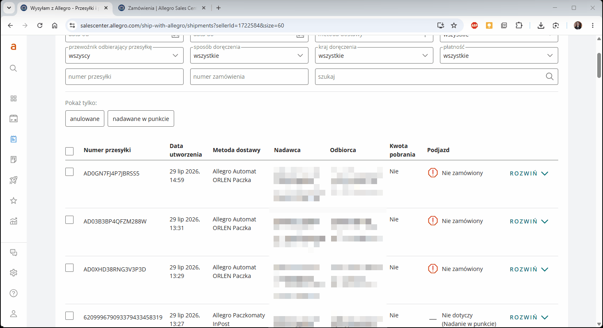 

Jest to rozszerzenie do przeglądarki Chrome. Wszystkie rozszerzenia testuję tylko dla systemu Windows 10/11 i najnowszej wersji przeglądarki.  

**Na wstępie pragnę zaznaczyć że nie odpowiadam za żadne problemy wynikłe z użytkowania tego rozszerzenia. Z wielu funkcjonalności Sales Center po prostu nie korzystam tak więc nie wiem jak zachowa się ono w określonych sytuacjach.**  

**Instrukcja instalacji:**
1. Pobierz rozszerzenie "pdf_parser.zip" z listy plików widocznej powyżej i rozpakuj je tam gdzie zamierzasz je trzymać.
2. Kliknij ikonę menu rozszerzeń w prawym górnym rogu okna przeglądarki (ikona puzzla)  lub z menu przeglądarki wybierz "Rozszerzenia - Zarządzaj rozszerzeniami".
3. Włącz "Tryb dewelopera" w prawym górnym rogu okna przeglądarki 
4. Kliknij przycisk "Załaduj rozpakowane"  

	
5. Wybierz folder z uprzednio pobranym i rozpakowanym rozszerzeniem.
6. Po załadowaniu rozszerzenia otworzy się strona jego opcji, gdzie będziesz mógł uzupełnić niezbędne parametry wymagane do jego działania (możesz to zrobić też w dowolnym momencie wybierając "Opcje" w menu kontekstowym rozszerzenia).  

	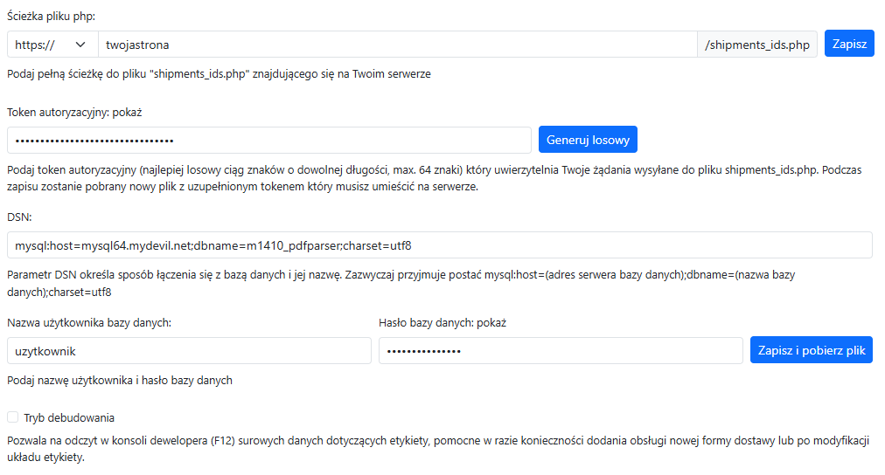  

	Tak jak wspomniano wcześniej, rozszerzenie wymaga bazy danych na numery przesyłek. Z racji tego że obecnie każdy prowadzący działalność posiada swoją stronę internetową, nie powinno stanowić to problemu.  

	Pierwszym parametrem który należy uzupełnić jest **adres pod którym znajduje się plik "shipments_ids.php"** obsługujący bazę danych. Nie ma specjalnych wymagań odnośnie wersji PHP (powinno działać dla każdej od 5.4 w górę, wymagane rozszerzenia: pdo, pdo_mysql, json), a więc praktycznie każda konfiguracja serwera bez potrzeby dokonywania jakichkolwiek zmian. Pamiętaj o kliknięciu przycisku "Zapisz".  

	Kolejnym parametrem jest **token autoryzacyjny**, który uwierzytelnia połączenie między rozszerzeniem a plikiem obsługującym bazę danych. Możesz wygenerować w tym celu losowy ciąg znaków lub wpisać dowolną wartość.  

	Parametr **DSN** zawiera informacje potrzebne do połączenia z bazą danych - adres serwera na którym znajduje się baza, a także jej nazwę. Te informacje znajdziesz w panelu administracyjnym Twojego hostingu. Zazwyczaj ma on postać  
	`mysql:host=(...);dbname=(...);charset=utf8`  

	Parametry **Nazwa użytkownika bazy danych** i **Hasło bazy danych** mówią same za siebie. Muszą to być te parametry które ustawiłeś podczas tworzenia bazy na swoim serwerze.  

	Po uzupełnieniu tokena oraz parametrów dotyczących bazy danych kliknij przycisk "Zapisz i pobierz plik". Zmiany zostaną zapisane zarówno w pamięci rozszerzenia, jak i zostaną naniesione do pliku "shipments_ids.php", którego kopia zostanie pobrana przez przeglądarkę. Ten pobrany przez przeglądarkę plik (a nie plik szablonu który nie zawiera uzupełnionych danych i znajduje się w folderze rozszerzenia) musisz umieścić na swoim serwerze pod adresem który wpisałeś w ustawieniach.

	Opcja **Tryb debugowania** pozwala na odczyt surowych danych z pdfa w konsoli dewelopera (F12). Pomocne w przypadku gdy trzeba dodać obsługę nowego przewoźnika lub gdy zmieni się format etykiety i potrzebne będzie dokonanie zmian w programie - w takim wypadku, po zanonimizowaniu danych osobowych podeślij mi przykładowy rezultat.

7. Odnośnie bazy danych, musisz utworzyć następującą bazę zawierającą tabelę z 3 kolumnami (przykładowy zrzut ekranu z phpMyAdmin):

	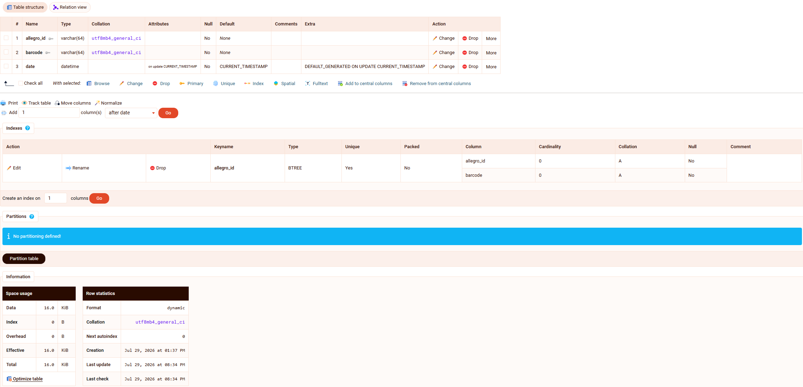  
	<br>
	<br>

	Mając nowo utworzoną, pustą bazę danych, możesz utworzyć jej strukturę wykonując kod w zakładce SQL:  

	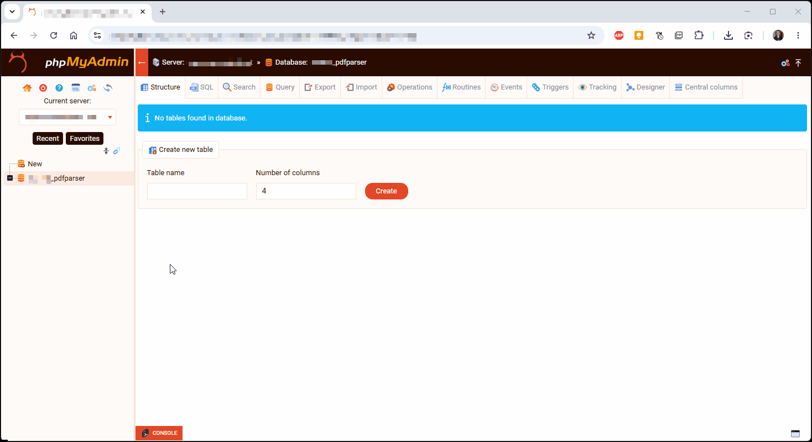 

	<details>
	<summary>Pokaż kod SQL</summary>  

	```
	-- phpMyAdmin SQL Dump
	-- version 5.2.2
	-- https://www.phpmyadmin.net/
	--
	-- Host:
	-- Generation Time: Jul 27, 2026 at 08:36 PM
	-- Server version: 8.0.43
	-- PHP Version: 8.1.33

	SET SQL_MODE = "NO_AUTO_VALUE_ON_ZERO";
	START TRANSACTION;
	SET time_zone = "+00:00";

	--
	-- Database: `prefix_pdfparser`
	--
	CREATE DATABASE IF NOT EXISTS `prefix_pdfparser` DEFAULT CHARACTER SET utf8mb4 COLLATE utf8mb4_general_ci;
	USE `prefix_pdfparser`;

	-- --------------------------------------------------------

	--
	-- Table structure for table `shipments_ids`
	--

	CREATE TABLE `shipments_ids` (
		`allegro_id` varchar(64) CHARACTER SET utf8mb4 COLLATE utf8mb4_general_ci NOT NULL,
		`barcode` varchar(64) CHARACTER SET utf8mb4 COLLATE utf8mb4_general_ci NOT NULL,
		`date` datetime NOT NULL DEFAULT CURRENT_TIMESTAMP ON UPDATE CURRENT_TIMESTAMP
	) ENGINE=InnoDB DEFAULT CHARSET=utf8mb4 COLLATE=utf8mb4_general_ci;

	--
	-- Indexes for dumped tables
	--

	--
	-- Indexes for table `shipments_ids`
	--
	ALTER TABLE `shipments_ids`
		ADD UNIQUE KEY `allegro_id` (`allegro_id`,`barcode`);

	DELIMITER $$
	--
	-- Events
	--
	CREATE EVENT `pdfParserRemoveOldData` ON SCHEDULE EVERY 1 DAY STARTS '2026-07-24 00:00:00' ON COMPLETION PRESERVE ENABLE DO DELETE FROM `shipments_ids` WHERE `date` < NOW() - INTERVAL 14 DAY$$

	DELIMITER ;
	COMMIT;
	```
	</details>
	Pamiętaj że na serwerze współdzielonym będziesz miał przypisany unikalny prefiks, podstaw go w kodzie wszędzie tam gdzie występuje słowo prefix  

	<br>
	<br>
	Możesz też wszystko "wyklikać":  

	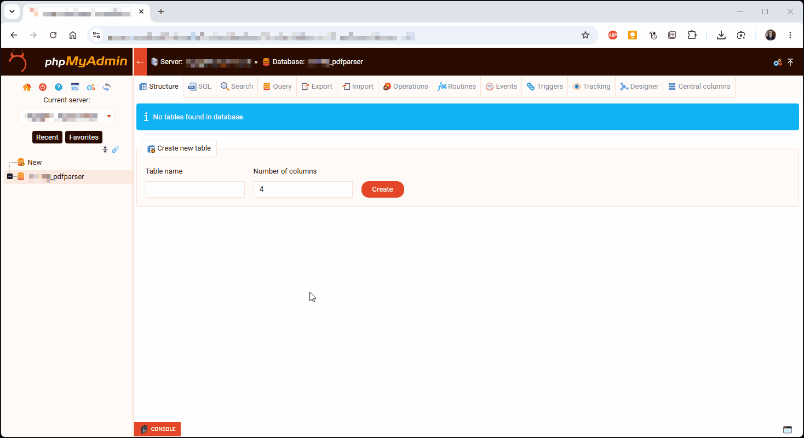  

	<details>
	<summary>Pokaż ręczne tworzenie tabeli</summary>  

	Nazwa tabeli: shipments_ids  

	Kolumny:  
	- nazwa: allegro_id, typ: VARCHAR, długość: 64, porównywanie napisów: utf8mb4_general_ci
	- nazwa: barcode, typ: VARCHAR, długość: 64, porównywanie napisów: utf8mb4_general_ci
	- nazwa: date, typ: DATETIME, domyślnie: CURRENT_TIMESTAMP, atrybuty: on update CURRENT_TIMESTAMP

	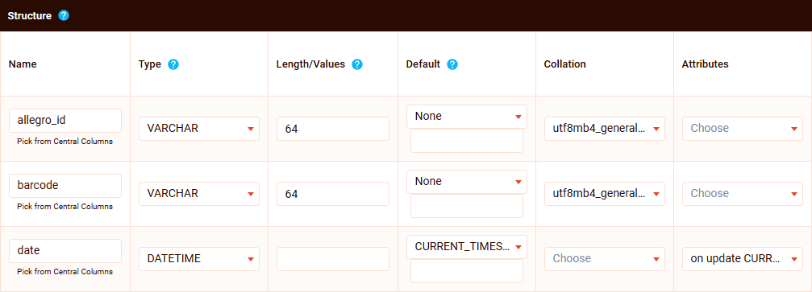  

	Po utworzeniu kolumn, zaznacz kolumny allegro_id i bacrode a następnie utwórz na nich indeks typu Unique

	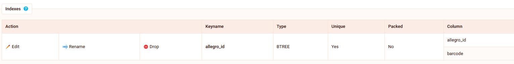  

	Jeśli masz aktywną zakładkę Events w phpMyAdmin, możesz skorzystać z funkcjonalności automatycznego czyszczenia starych danych po określonym czasie. W tym celu stwórz nowe zdarzenie

	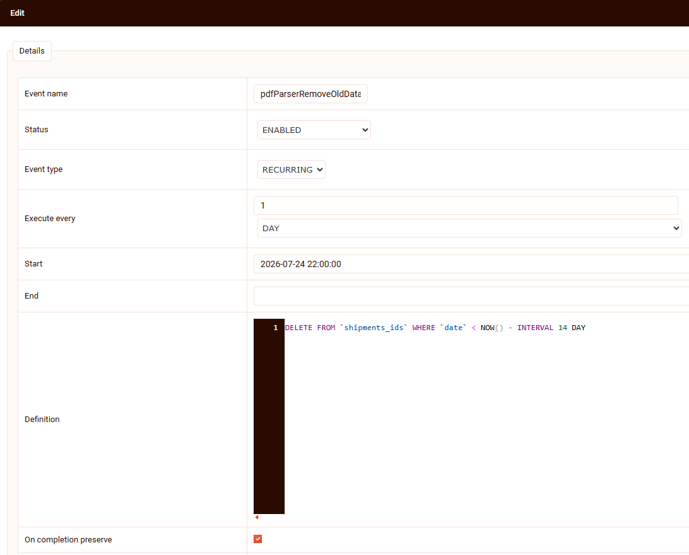  
	- nazwa zdarzenia: dowolna, ja ustawiłem pdfParserRemoveOldData
	- status: włączone
	- typ: powracające
	- wyzwól co: 1 dzień
	- start: data rozpoczęcia, może być obecna, przeszła, albo przyszła - wtedy zacznie działać dopiero po niej
	- koniec: pozostaw puste
	- definicja: ```DELETE FROM `shipments_ids` WHERE `date` < NOW() - INTERVAL 14 DAY```
	- zaznacz "po zakończeniu zachować"

	</details>  


8. Aby rozszerzenie mogło widzieć pliki pobranych etykiet wymagane jest utworzenie tzw. dowiązania symbolicznego (to coś podobnego do skrótu). W tym celu otwórz wiersz polecenia (jako administrator) (wciśnij klawisze Win + R wpisz cmd, jeśli jesteś na koncie administratora - kliknij OK lub wciśnij Enter, jeśli jesteś na koncie użytkownika standardowego - wciśnij Ctrl + Shift + Enter aby uruchomić wiersz poleceń jako administrator) albo kliknij Menu Start, wpisz cmd lub wiersz polecenia, jeśli jesteś na koncie administratora - kliknij uruchom lub wciśnij Enter, jeśli jesteś na koncie użytkownika standardowego - kliknij "Uruchom jako administrator". Następnie wpisz (zachowując znaki cudzysłowiu):

	`mklink /D "ścieżka folderu rozszerzenia\downloads" "lokalizacja pobieranych plików"`

	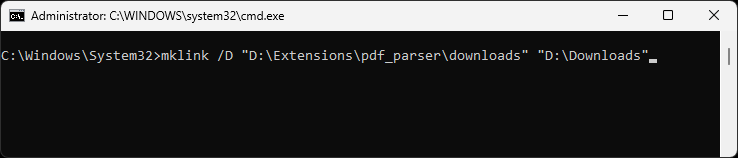

	System potwierdzi utworzenie dowiązania symbolicznego  

	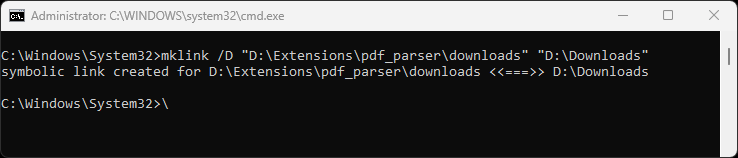  

	Gdy wejdziesz teraz do folderu "downloads" znajdującego się w folderze rozszerzenia, powinieneś zobaczyć zawartość folderu do którego przeglądarka domyślnie pobiera pliki.

	<br>
	<br>
	Jeżeli przycisk pobierania etykiety podświetlony jest na zielono, oznacza to że nastąpi sprawdzanie pobranego pliku pod kątem występowania w nim przesyłek których numery chcesz uzyskać. Działa to zarówno dla pobierania etykiety bezpośrednio po jej nadaniu, jak i w szczegółach zamówienia oraz na stronie "przesyłki i podjazdy", zarówno pojedynczo jak i grupowo. Jeżeli pobierana etykieta dotyczy zamówienia które nie musi być przetwarzane bo jest to forma dostawy która tego nie wymaga, to przycisk nie będzie podświetlany na zielono.

	Osoba która będzie skanować kody kreskowe na etykietach ma informację o tym że rozszerzenie jest aktywne i będzie sprawdzać kod kreskowy w postaci małego wskaźnika - ikonki kodu kreskowego nad polem wyszukiwania. 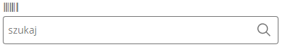  
Po zeskanowaniu kodu po krótkiej chwili nastąpi sprawdzenie czy jest on w bazie i czy przypisany jest do niego numer przesyłki Allegro, jeśli tak, to ten numer zostanie wklejony w pole wyszukiwania co wyświetli dane zamówienie.
